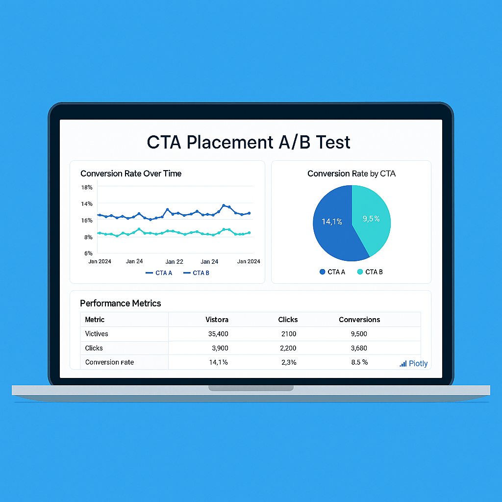
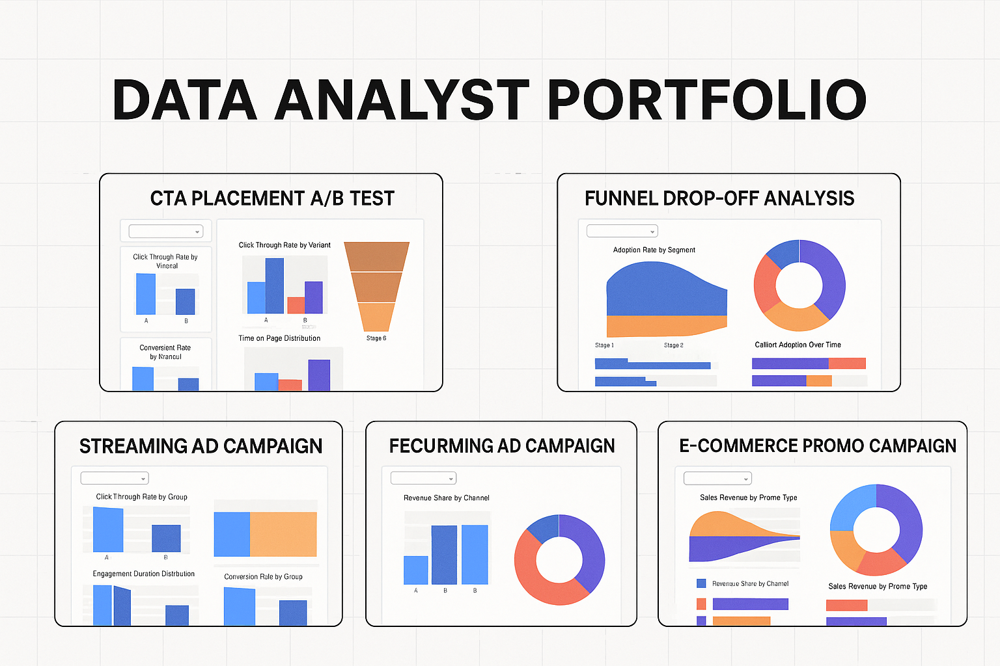
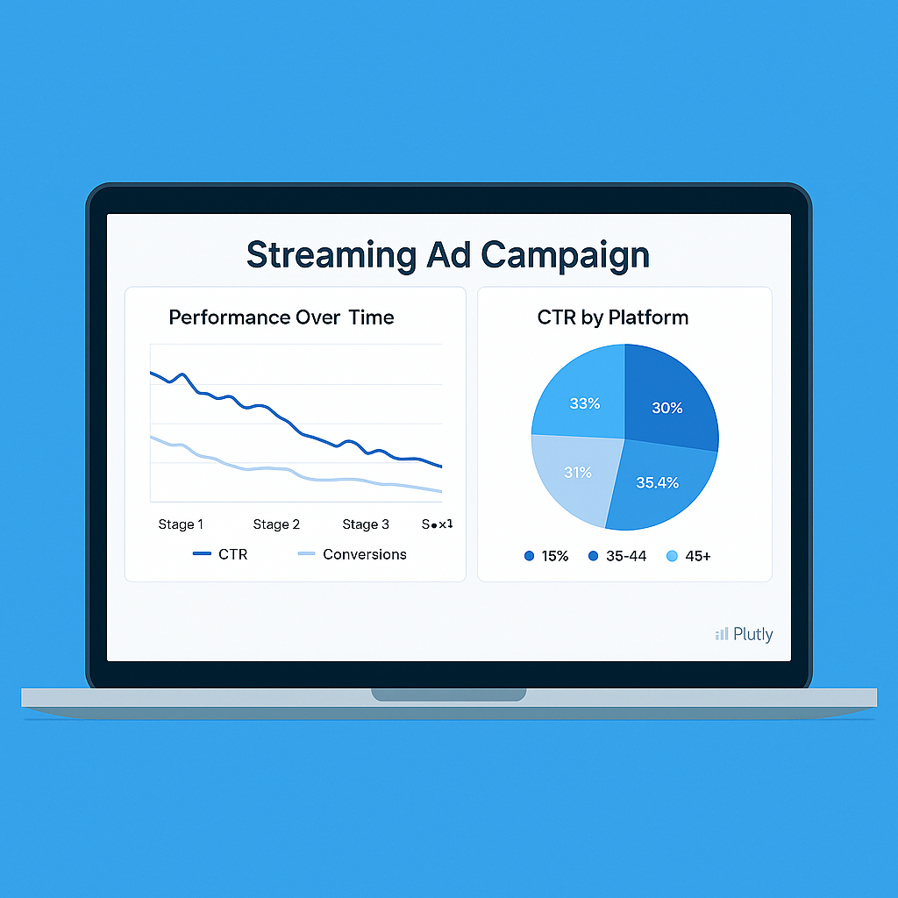

# Hi, I'm Jenna Hayes

I'm a data and product analyst who loves translating complex user behavior into clear, actionable insights. With a foundation in behavioral science and hands-on experience in A/B testing, funnel analysis, and campaign optimization, I help teams make data-informed decisions that drive impact.

This portfolio showcases projects that reflect my approach: user-first, experiment-driven, and insight-led. From optimizing CTA placement and tracking feature adoption to uncovering drop-off patterns and improving campaign ROI — each case study combines technical depth with business relevance.

Feel free to explore the dashboards, download the summaries, and check out the code behind the insights.

## Featured Projects

<!-- CTA Test -->

**CTA Placement A/B Test**  
Optimizing CTA position to improve CTR across devices.  
🔗 [View Dashboard](assets/cta-ab-test.html)

<!-- Funnel Drop-Off -->

**Funnel Drop-Off Analysis**  
Visualizing and reducing user friction across onboarding.  
🔗 [View Dashboard](assets/funnel-dropoff.html)

<!-- Feature Adoption -->

**Feature Adoption Dashboard**  
Measuring behavior-focused rollout success.  
🔗 [View Dashboard](assets/feature-adoption.html)

<!-- Streaming Campaign -->

**Streaming Ad Campaign**  
Analyzing performance of ad creatives and platforms.  
🔗 [View Dashboard](assets/streaming-campaign.html)

<!-- E-commerce Campaign -->

**E-commerce Promo Campaign**  
Evaluating ROI and conversions across marketing channels.  
🔗 [View Dashboard](assets/ecommerce-campaign.html)

