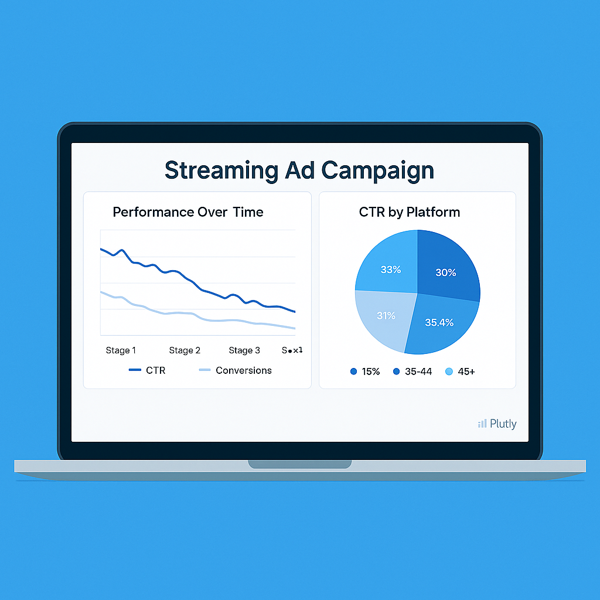

# Hi, I'm Jenna Hayes

[Download Resume](resume.pdf) | [Contact Me](mailto:jenna.hayes0110@gmail.com) | [LinkedIn](https://linkedin.com/in/jennahayes92)

I'm a data and product analyst who loves translating complex user behavior into clear, actionable insights. With a foundation in behavioral science and hands-on experience in A/B testing, funnel analysis, and campaign optimization, I help teams make data-informed decisions that drive impact.

This portfolio highlights my approach: user-first, experiment-driven, and insight-led. From optimizing CTA placement and tracking feature adoption to uncovering drop-off patterns and improving campaign ROI — each case study combines technical depth with business relevance.

Feel free to explore the dashboards, download the summaries, and dive into the code behind the insights.

## Featured Projects

<!-- CTA Test -->

<strong>CTA Placement A/B Test</strong> 
Optimizing CTA position to improve CTR across devices. 
<a href="assets/cta-ab-test.html">View Dashboard</a>

<!-- Funnel Drop-Off -->

<strong>Funnel Drop-Off Analysis</strong> 
Visualizing and reducing user friction across onboarding. 
<a href="assets/funnel-dropoff.html">View Dashboard</a>

<!-- Feature Adoption -->

<strong>Feature Adoption Dashboard</strong> 
Measuring behavior-focused rollout success. 
<a href="assets/feature-adoption.html">View Dashboard</a>

<!-- Streaming Campaign -->

<strong>Streaming Ad Campaign</strong> 
Analyzing performance of ad creatives and platforms. 
<a href="assets/streaming-campaign.html">View Dashboard</a>

<!-- E-commerce Campaign -->

<strong>E-commerce Promo Campaign</strong> 
Evaluating ROI and conversions across marketing channels. 
<a href="assets/ecommerce-campaign.html">View Dashboard</a>

